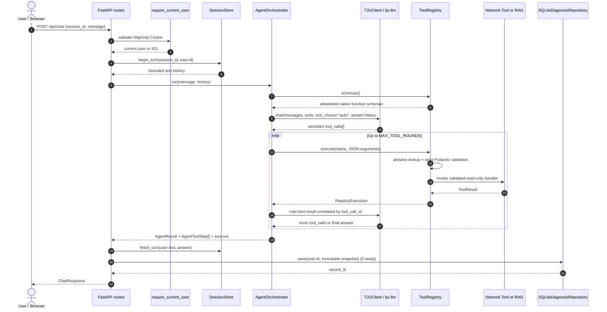

# TJU NetPilot Architecture

本文档以当前 [`src/netpilot/`](../src/netpilot/) 源码为准，描述 `agent2026-netpilot` 的真实运行时结构。产品中文名称为“天津大学校园网络智能诊断与服务 Agent”，模型为 `tju-llm`。

## Architecture Overview

TJU NetPilot 是一个 Single Agent + Tools 应用。FastAPI 提供 Web/API 边界，`AgentOrchestrator` 负责有界 Function Calling，`ToolRegistry` 负责 allowlist 与参数校验，`NetworkToolService` 在 Mock/Local Provider 之间提供稳定契约。RAG、SQLite 历史和报告位于旁路能力，不扩大网络 Tool 权限。

```text
┌──────────────────────────────────────────────────────────────────────────────┐
│ Client                                                                       │
│  Browser: web/index.html + app.js + style.css     API client                 │
└───────────────────────────────┬──────────────────────────────────────────────┘
                                │ HTTP / same-origin JSON / SSE
                                v
┌──────────────────────────────────────────────────────────────────────────────┐
│ FastAPI: netpilot.main.create_app()                                          │
│  request_logging_middleware()                                                │
│  netpilot.api.auth_routes + netpilot.api.routes                              │
│  /auth/* /health /session /chat /chat/stream /diagnoses /reports /scenarios │
│  StaticFiles("web/", html=True)                                              │
└──────────────┬──────────────────┬─────────────────────────┬───────────────────┘
               │                  │                         │
               │ begin/finish     │ save/read               │ scenario control
               v                  v                         v
┌──────────────────────┐  ┌────────────────────────┐  ┌───────────────────────┐
│ SessionStore         │  │ SQLiteDiagnosis-      │  │ runtime_lock +       │
│ bounded in-memory    │  │ Repository            │  │ Mock scenario state  │
│ owner_user_id       │  │ user_id + snapshots   │  └───────────────────────┘
└──────────┬───────────┘  └───────────┬────────────┘
           │ history                  │
           │                          └──> build_diagnosis_report()
           │                               Markdown / JSON export
           v
┌──────────────────────────────────────────────────────────────────────────────┐
│ AgentOrchestrator                                                            │
│  messages + tool schemas + MAX_TOOL_ROUNDS + dedupe + evidence fallback     │
└──────────────┬───────────────────────────────────────────┬───────────────────┘
               │ chat(stream=false)                        │ execute(name,args)
               v                                           v
┌──────────────────────────┐                  ┌─────────────────────────────────┐
│ TJUClient                │                  │ ToolRegistry                    │
│ OpenAI-compatible SDK    │<--tool results--│ allowlist + strict Pydantic     │
│ model: tju-llm           │  by call ID      │ schemas + safe errors           │
└──────────────┬───────────┘                  └──────────────┬──────────────────┘
               │ native tool_calls                           │
               v                                             ├───────────────┐
        TJU competition API                                  │               │
                                                             v               v
                                           ┌────────────────────────┐  ┌──────────────┐
                                           │ NetworkToolService     │  │ knowledge_   │
                                           │ stable six-tool facade │  │ search       │
                                           └───────────┬────────────┘  └──────┬───────┘
                                                       │                      │
                                         ┌─────────────┴─────────────┐        v
                                         v                           v  ┌──────────────┐
                              ┌────────────────────┐      ┌────────────┤FaissRetriever│
                              │MockNetworkProvider │      │LocalNetwork│local index   │
                              │offline scenarios   │      │Provider    └──────┬───────┘
                              └────────────────────┘      │host-only  │      │
                                                          └───────────┘      v
                                                                    knowledge/index/

ToolResult / AgentToolStep
          │
          v
finding_status() --> assess_diagnosis() --> present_chat() --> ChatResponse
```

## Repository Structure

```text
agent2026-qa-bot/
├── README.md                    # 比赛提交入口
├── DESIGN.md                    # 设计目标与取舍
├── pyproject.toml               # Python package: agent2026-netpilot
├── .env.example                 # 无密钥的配置模板
├── src/netpilot/                # 正式产品 Python 代码
│   ├── main.py                  # FastAPI composition root
│   ├── config.py                # Settings、ToolMode、MockScenario
│   ├── agent/                   # AgentOrchestrator、ToolRegistry、Session、诊断
│   ├── api/                     # routes、presenters、SSE encoder
│   ├── auth/                    # 用户、Argon2id、服务端 Auth Session、依赖
│   ├── llm/                     # TJUClient 与 LLM schemas/errors
│   ├── tools/                   # Provider contract、Mock/Local、输入/结果 schemas
│   ├── rag/                     # loader、chunker、embedding、FAISS、retriever
│   ├── models/                  # 公共 API schemas
│   ├── history.py               # SQLite diagnosis repository
│   ├── reports.py               # 确定性报告与导出
│   └── observability.py         # 结构化日志与 request/session correlation
├── web/                         # 正式中文 Web 静态资源
├── knowledge/
│   ├── raw/                     # 带来源 front matter 的知识文档
│   └── index/                   # 本地生成的 FAISS artifacts（若已构建）
├── scripts/                     # 索引构建、产品/模型冒烟脚本及上游脚本
├── tests/                       # 自动化测试
├── docs/                        # 架构、验收、上游和既有 Milestone 文档
├── screenshots/                 # 真实截图采集说明及已提供的双账号页面 PNG
├── labs/                        # 上游 Labs 1–6
├── lab/                         # 上游 Containerlab topology/configs
├── examples/                    # 上游示例与 mock spine/leaf
├── bonus/                       # 上游额外教学实验
└── prompts/                     # 上游提示模板
```

正式产品边界是 `src/netpilot/`，并使用 `web/`、`knowledge/`、部分 `scripts/` 和 `tests/`。`labs/`、`lab/`、`examples/`、`bonus/`、`prompts/`、`docs/design-toolkit/` 是保留的上游教学资源，不应被描述为 NetPilot 运行时模块。详见 [`upstream.md`](upstream.md)。

## Runtime Components

`netpilot.main.create_app()` 是 composition root，构造并保存以下 `app.state` 组件：

| 组件 | 真实类/工厂 | 职责 |
|---|---|---|
| 配置 | `Settings` | 读取并校验环境变量和根目录 `.env` |
| LLM | `TJUClient` | 非流式 Chat Completions 与原生 Function Calling |
| 网络 Tool facade | `build_network_tools()` → `NetworkToolService` | 选择 Mock 或 Local Provider |
| RAG | `load_configured_retriever()` → `FaissRetriever | None` | 离线加载匹配的本地索引与模型缓存 |
| Registry | `ToolRegistry` | 暴露 allowlist schemas、校验并 dispatch Tool |
| Agent | `AgentOrchestrator` | 有界 Tool loop、去重、来源聚合与 fallback |
| 认证 | `AuthService`、`UserRepository`、`AuthSessionRepository` | SQLite 用户/Session，HttpOnly Cookie 解析与当前用户依赖 |
| 会话 | `SessionStore` | 绑定 owner 的有界内存文本历史与 busy 控制 |
| 历史 | `SQLiteDiagnosisRepository | None` | 按用户保存及读取不可变诊断快照 |
| 并发锁 | `RLock` (`runtime_lock`) | 防止 Agent 运行中切换 Mock 场景 |

应用构造不发起 TJU 模型或网络 Tool 请求。关闭应用时，lifespan 会释放 `TJUClient` 自己持有的 SDK transport。

## Request Flow

通用 HTTP 流程：

1. 请求进入 `request_logging_middleware()`，校验/生成 `X-Request-ID` 并写入安全结构化日志上下文。
2. 受保护路由通过 `require_current_user()` 验证服务端 Auth Session Cookie；未登录返回 401。Pydantic request model 校验 UUID、消息长度、字段白名单和查询参数。
3. chat 路由确认 `TJUClient.configured`，再通过 `SessionStore.begin_turn(session_id, user.id)` 校验 owner、获取历史并将会话标为 busy；其他用户的 session 返回 404。
4. `AgentOrchestrator.run()` 在 `runtime_lock` 内执行，避免同一轮诊断观察到两个 Mock 场景。
5. `present_chat()` 把 `AgentResult` 转换为公开 `ChatResponse`，包括 diagnosis、metrics、Tool Timeline 和 sources。
6. 若历史仓库可用，连同 `user.id` 保存快照并把 `record_id` 加入响应；保存失败只记录安全告警，不使聊天失败。
7. 完成/异常路径分别调用 `finish_turn()`/`abort_turn()`，确保 busy 状态释放。

### POST /api/chat

```text
ChatRequest
  -> require_current_user() / HttpOnly Cookie
  -> configured check
  -> SessionStore.begin_turn(session_id, user.id)
  -> runtime_lock
  -> AgentOrchestrator.run(message, history)
  -> SessionStore.finish_turn(user text, assistant text)
  -> present_chat()
  -> SQLiteDiagnosisRepository.save(user.id, ...) [optional, degradable]
  -> ChatResponse
```

预校验错误使用普通 HTTP 状态：未配置 LLM 为 503，未知 session 为 404，busy session 为 409，Pydantic 输入错误为 422。未预期的 Agent 错误会释放 session 并返回不包含内部异常的 500。

### POST /api/chat/stream

```text
ChatRequest
  -> same authentication, prevalidation and SessionStore.begin_turn(session_id, user.id)
  -> StreamingResponse(text/event-stream)
       -> start event
       -> worker: same Agent turn + session finalization + optional history save
       -> keep-alive comments while waiting
       -> delta events made from the completed answer
       -> complete event carrying the full ChatResponse
       \-> safe error event if worker failed after headers
```

该接口是 transport-level SSE。`TJUClient.chat()` 固定发送 `stream=false`；只有完整 Agent/Tool 结果完成后，`iter_chat_sse()` 才按字符块发出 `delta`。因此它不是模型 token streaming。

## Agent Tool-Calling Sequence



当模型直接给出普通知识答案时，序列中可以没有 Tool 执行。若用户明确点名 Tool，Orchestrator 会追踪未完成的请求；若出现重复 Tool/目标、达到轮次上限或最终响应异常，会停止继续执行，并根据已有证据生成保守 fallback。

## Tool Layer

六个网络 Tool 通过 `NetworkProvider` 抽象、`NetworkToolService` facade 和 `ToolRegistry` 共用同一输入/结果契约。

| Tool | 输入模型 | Provider 方法 | 主要证据 | 安全边界 |
|---|---|---|---|---|
| `get_network_info` | `GetNetworkInfoInput` | `get_network_info()` | 网卡、IPv4、默认网关、DNS | 不返回链路层地址；仅本机 |
| `ping_host` | `PingHostInput` | `ping_host(host, count)` | reachable、丢包、时延 | Host 校验；固定命令参数；超时/输出上限 |
| `dns_lookup` | `DNSLookupInput` | `dns_lookup(domain)` | resolved、addresses | 域名校验；有界 resolver |
| `tcp_check` | `TCPCheckInput` | `tcp_check(host, port, timeout)` | connected、failure reason | Host/端口/超时范围；Socket 关闭 |
| `http_check` | `HTTPCheckInput` | `http_check(url)` | request_sent、reachable、status、redirects、resolved addresses | HTTP(S) only；DNS/IP/每次重定向 SSRF 检查；不下载正文 |
| `traceroute` | `TracerouteInput` | `traceroute(host, max_hops)` | hops、reached destination | Host/跳数；固定参数；命令缺失安全降级 |
| `knowledge_search`（可选） | `KnowledgeSearchInput` | Retriever adapter | 带来源的 reference results | 仅 RAG 就绪时注册；非网络状态证据 |

`NetworkProvider._execute()` 把校验错误、预期执行错误和意外异常统一转换为 `ToolResult`。`ToolObservation` 表示“成功获得观察”，因此负面观察仍可以是 `success=true`。`finding_status()` 再将其解释为正常、异常、错误、不确定、安全阻止或参考。

### Provider implementations

- `MockNetworkProvider`：确定性合成 typed data；六个内置场景为 `healthy`、`dns_failure`、`gateway_unreachable`、`tcp_ssh_blocked`、`http_failure`、`partial_connectivity`。自定义场景也是严格 Schema 的进程内数据，不解释任意脚本。
- `LocalNetworkProvider`：读取运行 NetPilot 主机的接口配置，并在该主机执行受限 Ping、DNS、TCP、HTTP、traceroute。它不检测远端浏览器主机，不登录校园设备，不修改配置。

## RAG Pipeline

```text
knowledge/raw/*.md|*.txt
  -> load_documents()
       UTF-8 / size / count / no-symlink / front matter / URL / source_type
  -> chunk_documents()
       deterministic Chinese-friendly boundaries + overlap + stable chunk_id
  -> FastEmbedProvider.embed_documents()
       configured BGE model
  -> build_index()
       L2 normalization + FAISS IndexFlatIP
  -> knowledge/index/
       vectors.faiss + chunks.json + manifest.json

Application startup
  -> load_configured_retriever()
       existing files + expected model + dimension/count consistency
       local model cache only; no startup download
  -> FaissRetriever or None

Campus knowledge intent
  -> ToolRegistry.knowledge_search
  -> validated query embedding
  -> cosine Top-K
  -> RAG_MIN_SCORE filter
  -> KnowledgeSearchData + KnowledgeSource[]
```

每份文档必须声明 `title`、HTTP(S) `source` 和 `source_type`。当前仓库种子全部是 `community`；Schema 可接受 `official` 和 `maintainer`，但类型必须由资料真实来源决定。所有检索文本均是 untrusted reference data，只能作为回答参考，不能改变系统指令、Tool allowlist 或安全策略。

## Session and Persistence

| 维度 | `SessionStore` | `SQLiteDiagnosisRepository` |
|---|---|---|
| 用途 | 给下一轮 Agent 提供对话上下文 | 回看、分页、报告和导出 |
| 存储 | 进程内字典 | 本地 SQLite 文件 |
| 所有权 | `owner_user_id`，跨用户 session 404 | 行与新快照均带 `user_id`；查询按 owner 过滤 |
| 内容 | 仅 user/assistant 文本消息 | 完整不可变诊断快照 |
| 生命周期 | 进程重启或 clear 后消失 | 跨应用重启保留 |
| 上限 | `MAX_HISTORY_MESSAGES`、`MAX_SESSIONS` | `DIAGNOSIS_MAX_RECORDS` |
| 并发 | `RLock`、单 session busy 标记 | `RLock`、WAL、busy timeout、参数化 SQL |
| 失败语义 | 未知/busy/capacity 映射到 API 错误 | 初始化/读写错误安全封装；写失败不影响聊天 |

报告不再次调用模型。`build_diagnosis_report()` 从保存的 `DiagnosisRecordView` 确定性生成 `DiagnosisReportView`，`export_diagnosis_report()` 生成有大小上限、稳定文件名的 Markdown 或 JSON。

现有 v1 历史表通过事务性、幂等迁移增加可空 `user_id`。旧记录保留为 `NULL`，普通用户不可见；新记录带当前用户 ID。`users` 与 `auth_sessions` 位于同一个 `DIAGNOSIS_DB_PATH`，但 Auth Session 与聊天 `SessionStore` 是两类不同状态。

## Web and API

`web/` 由 FastAPI `StaticFiles` 挂载到 `/`。9C 页面先请求 `/api/auth/me`：有效 Cookie 显示主界面并加载个人 Session/History，401 显示登录/注册面板。右上角当前用户菜单提供“我的诊断历史”、改密和退出；退出或登录过期会清空前一账号的会话、诊断与报告 DOM。浏览器用 `credentials: "same-origin"` 调用同源 API，不将密码或 Auth Token 放入本地浏览器存储。聊天、诊断摘要、Tool Timeline、来源、指标、历史、报告与 Mock 场景仍经文本 DOM 接口安全渲染。

主要 API：

| Method | Path | 作用 |
|---|---|---|
| GET | `/api/health` | LLM、Provider、RAG、History readiness |
| POST/GET | `/api/auth/*` | 注册、登录、退出、当前用户、修改密码 |
| POST | `/api/session` | 创建内存会话 |
| POST | `/api/chat` | 非 SSE 的完整 `ChatResponse` |
| POST | `/api/chat/stream` | transport-level SSE |
| GET | `/api/diagnoses` | 游标分页的历史摘要 |
| GET | `/api/diagnoses/{record_id}` | 完整诊断快照 |
| GET | `/api/diagnoses/{record_id}/report` | 确定性报告预览 |
| GET | `/api/diagnoses/{record_id}/export` | `markdown`/`json` 下载 |
| GET | `/api/scenarios` | Mock 场景列表 |
| POST | `/api/scenarios/{scenario}` | 受开关保护的切换 |
| POST | `/api/scenarios/custom` | 创建严格自定义 Mock 场景 |
| DELETE | `/api/scenarios/custom/{name}` | 删除自定义场景 |

除健康检查与 Mock 场景列表外，表中聊天、历史、报告和场景写接口均要求当前用户。按 `record_id` 的详情、报告和导出通过 `record_id + user_id` 查询；跨用户返回 404。详细验收见 [`MILESTONE9B_VALIDATION.md`](MILESTONE9B_VALIDATION.md)。

## SSE Flow

SSE 协议只发送 JSON data 与 keep-alive comment：

```text
id: 0  event: start     data: {schema_version, session_id}
       : keep-alive    (worker 尚未完成时可重复)
id: n  event: delta     data: {schema_version, sequence, text}
id: n  event: complete  data: {schema_version, response: ChatResponse}

or, after headers:
id: n  event: error     data: {schema_version, code, message, retryable}
```

`start` 在 worker 启动后立即发送。worker 拥有 session finish/abort，因此浏览器断开或 iterator 关闭不会使会话永久 busy。响应头设置 `no-cache, no-transform`、`X-Accel-Buffering: no` 与 `nosniff`。不可信文本经 JSON 序列化，不能注入新的 SSE 行。

## Configuration

`Settings` 使用 `pydantic-settings` 读取环境变量和根目录 `.env`。关键配置组：

- LLM：`TJU_API_KEY`、`TJU_API_BASE`、`TJU_MODEL=tju-llm`、超时与重试；
- Agent/Session：`MAX_TOOL_ROUNDS`、`MAX_HISTORY_MESSAGES`、`MAX_SESSIONS`；
- Tool：`TOOL_MODE=mock|local`、`MOCK_SCENARIO`、`NETWORK_TIMEOUT_SECONDS`；
- Demo：`SCENARIO_SWITCH_ENABLED`、`CUSTOM_SCENARIO_MAX_COUNT`；
- RAG：`RAG_ENABLED`、`EMBEDDING_MODEL`、Top-K、阈值、chunk 参数；
- History/Report：开关、SQLite 路径、记录与导出上限；
- Auth：`AUTH_ENABLED=true` 强制启用（false 拒绝启动）、Cookie 名称/Secure、登录时长与活跃 Session 上限；
- SSE：`SSE_CHUNK_CHARS`、`SSE_HEARTBEAT_SECONDS`；
- App/Logs：host、port、debug、log level。

`.env.example` 只提供模板。真实 `.env` 和 API Key 不应进入 Git、日志、响应或文档。
可信 LAN HTTP 演示的只读预检位于 `scripts/check_lan_demo.py`，仅检查本地配置与索引文件，不打开端口或接触网络；已收录两张双账号页面截图，防火墙、跨设备可达性及其余场景仍需人工核查，见 [`MILESTONE9D_LAN_DEMO.md`](MILESTONE9D_LAN_DEMO.md)。

## Error Boundaries

- `TJUClient` 将认证、限流、超时、连接、HTTP 服务和响应解析错误映射到不泄露内部细节的 typed errors。
- `ToolRegistry` 吞住不可信 Function name/JSON/schema/handler 错误并返回结构化 Tool failure。
- `NetworkProvider._execute()` 统一处理输入、预期 provider failure 与未知异常。
- Agent 在有证据时优先返回 deterministic fallback；达到上限使用 `MAX_TOOL_ROUNDS` 状态。
- API 在发送响应头前使用标准 HTTP 错误；SSE 发送头后只发安全 `error` event。
- RAG 不就绪时不注册 Tool；History 初始化/写入失败时保持核心聊天可用。

## Security Boundaries

1. **Credential boundary**：API Key 仅在服务端 `SecretStr`/SDK 中使用。
2. **Model boundary**：模型输出是不可信输入，只能进入 `ToolRegistry` allowlist 与严格 schema。
3. **Execution boundary**：网络 Tool 只读；固定命令参数、`shell=False`、超时和输出上限阻止 Shell 注入。
4. **Network boundary**：HTTP 工具阻止非 HTTP(S)、凭据 URL、localhost、metadata、私网、回环、链路本地地址及不安全重定向。
5. **Knowledge boundary**：RAG 文本是 untrusted reference data，来源类型不可提升权限。
6. **Persistence boundary**：SQLite 保存用户问题与证据，需要部署级文件权限和保留策略；报告内容继续转义不可信 Markdown。
7. **Scope boundary**：Local 只检测运行服务的主机；产品不接入内部运维平台，也不提供配置变更。

## Test Architecture

`tests/` 以单元和组件测试为主：

- Fake/recording LLM 验证原生 Function Calling、消息顺序、多个调用、call ID、上限和 fallback；
- Mock Provider 验证六场景、统一契约与零外部 I/O；
- monkeypatch 的 Local Provider 依赖验证跨平台参数、输出解析、超时、SSRF 和 shell 安全；
- 临时目录/哈希 Embedding 验证 RAG loader、chunk、index、阈值与来源；
- FastAPI `TestClient` 验证 health/session/chat/SSE/history/report/scenario API；
- 临时 SQLite 验证重启、并发、保留、游标与降级；
- 静态 Web 断言验证页面功能面、同源请求、文本渲染和响应式状态。
- `tests/test_lan_demo_preflight.py` 验证认证不可关闭、LAN HTTP 配置预检及不回显错误配置值；预检不等于实际网络/浏览器验收。

本套测试默认离线，不以真实模型或现场网络作为稳定依赖。完整映射见 [`test-cases.md`](test-cases.md)。

## Extension Points

- 新 Provider：实现 `NetworkProvider`，保持六 Tool 方法和 `ToolResult` 语义不变；
- 新只读 Tool：新增严格 input/data schema、Provider/service 实现与 `ToolRegistry` allowlist，并补齐安全测试；
- 新知识源：加入带真实 `source_type` 和 URL 的文档，重建索引；不得把 community 提升为 official；
- 新历史后端：实现 `DiagnosisRepository` Protocol，不改变 API snapshot contract；
- 真正 token streaming：需要扩展 `LLMClient` 与 Agent 状态机；不能把当前 SSE 重命名为 token streaming；
- 多进程会话或长任务：可替换 `SessionStore`，但需保留 busy、容量和隐私语义；
- Multi-Agent/图式编排：只有在出现可验证的并行、审批或长事务需求时再引入，并继续通过单一 Tool allowlist 控制执行权限。
